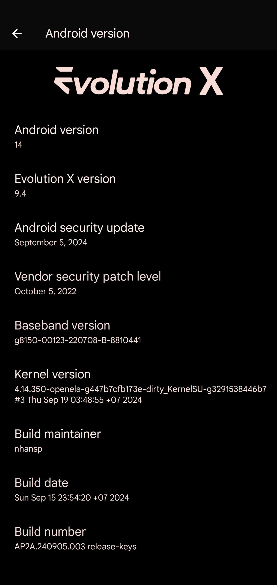
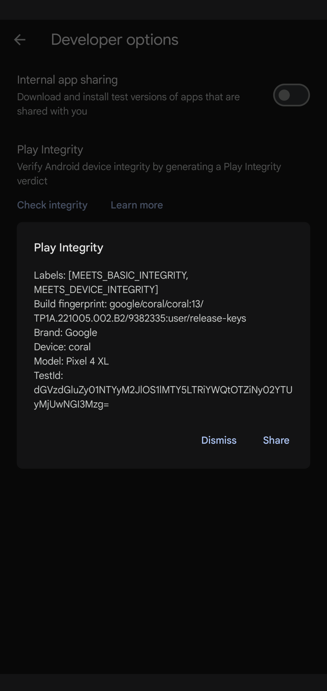
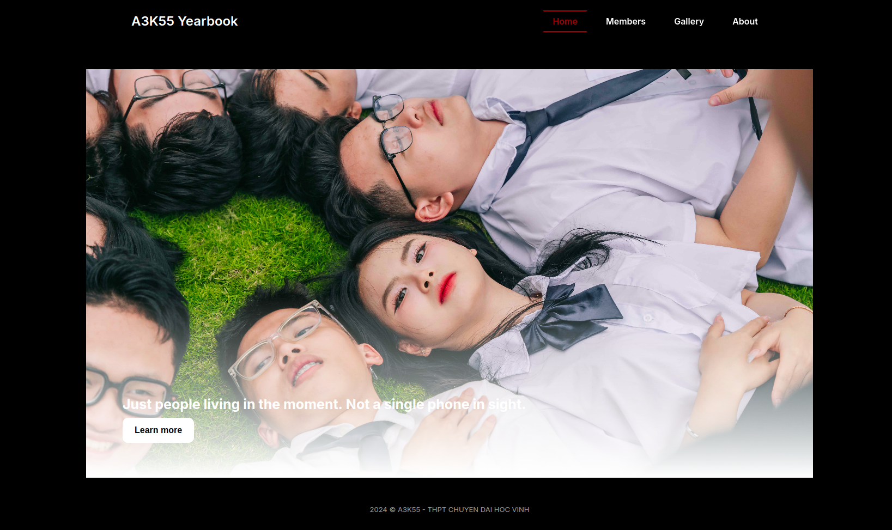

[https://nhansp.github.io/nhansp](https://nhansp.github.io/nhansp) is still available, but the source code has been moved to [`nhansp:web-archive`](https://github.com/nhansp/nhansp/tree/web-archive) branch.

## about me

currently studying Computer Science at Faculty of Techonology and Data Science, [Foreign Trade University](https://ftu.edu.vn).

previously studied at A3K55 (IT major), [Vinh University HSGS](https://truongthptchuyen.vinhuni.edu.vn).

## what im doing

* **Android**: building [Evolution X 9.4](https://github.com/Evolution-X) for Pixel 4 XL (coral) and Pixel 6a (bluejay) - with my own tweaks (I'm still a noob).

    Try out my builds at [https://tvyiutnhisokewt.github.io](https://tvyiutnhisokewt.github.io), or take a look at the [organization](https://github.com/tvyiutnhisokewt).

    For coral, it is shipped with KernelSU, with some GApps packages and boot animations removed to reduce the OTA size. 

      

* **Web development**: [A3K55 Yearbook](https://a3k55.vinhuni.edu.vn), my high school class' digital yearbook.

    It is currently being hosted by Vinh University (cool af ✨), and the source code and other stuff can be found at A3K55's GitHub organization  [here](https://github.com/a3k55yearbook).

    (the development is halted indefinitely until we are no longer lazy ☠️)

    

## other stuff

* **pc specs**: MSI Katana 15 B13VFK, i7 13620H, RTX 4060, 16GB/1TB on Ubuntu 24.04.1/Windows 11/macOS Sequoia (hackintosh barely works).

* ~~if you are involved in my situation, read [this](https://github.com/nhansp/nhansp/commit/4a76e852fc5b5f85c519309fb478edd18f2da9fd).~~
